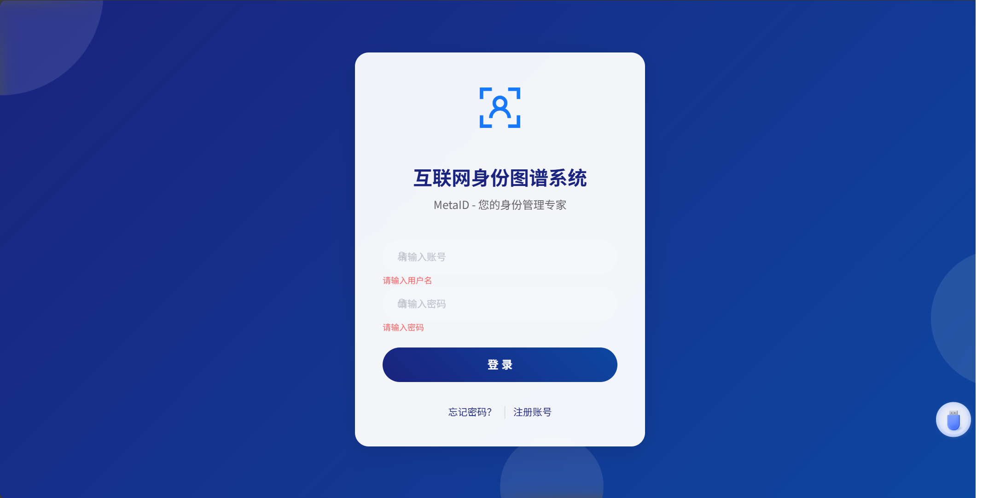
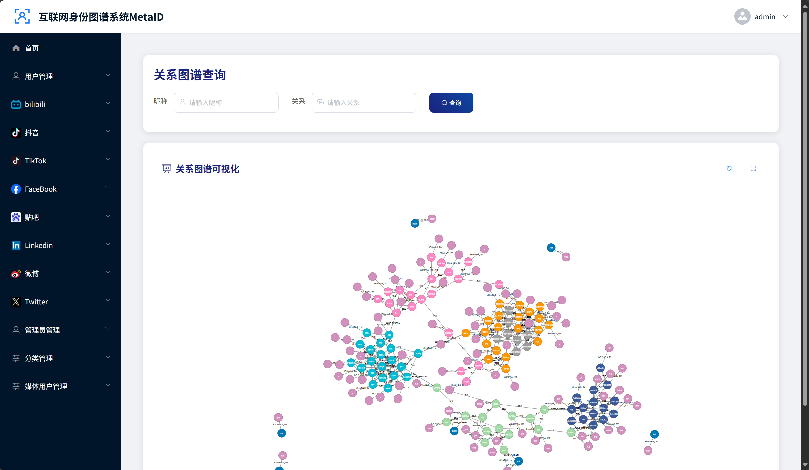
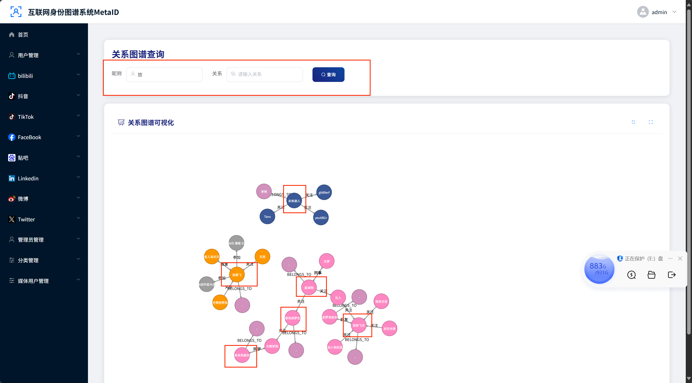
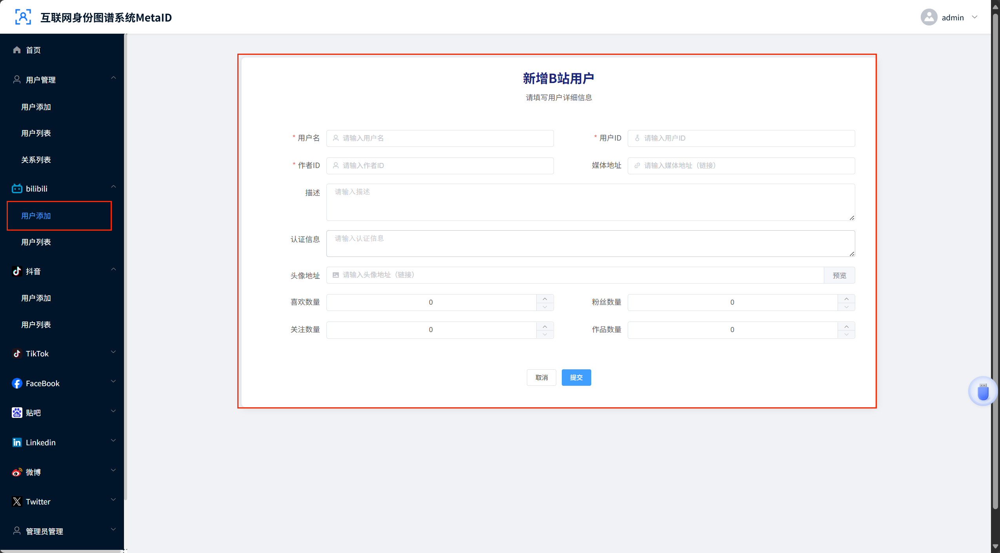
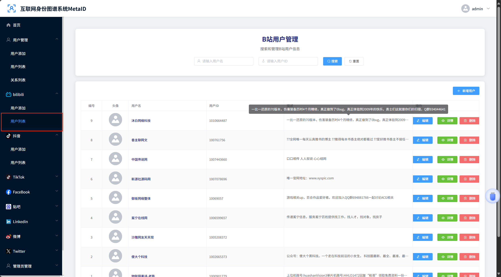

# 项目名称：XXXXXXXXX

注意事项：刚项目需要配合后端代码开启服务后使用

## 项目简介

这是一个基于 Vue.js 的前端项目，可能是一个管理系统或类似应用。项目使用了 Vue Router 进行页面导航，Element UI 作为 UI 组件库，并通过 Axios 进行 HTTP 请求。此外，项目还集成了 js-cookie 进行 Cookie 管理，vue-monoplasty-slide-verify 用于滑动验证，以及 Cytoscape 和 Neo4j Driver，可能用于图可视化或与 Neo4j 数据库交互。

## 技术栈

- Vue.js
- Vue Router
- Element UI
- Axios
- js-cookie
- vue-monoplasty-slide-verify
- Cytoscape
- Neo4j Driver

## 项目设置

1.  **安装依赖**

    ```bash
    npm install
    ```

2.  **运行开发服务器**

    ```bash
    npm run serve
    ```

    项目将在本地启动，通常在 `http://localhost:8080/`。

3.  **编译和压缩生产环境代码**

    ```bash
    npm run build
    ```

    生产环境的代码将生成在 `dist` 目录下。

## 交互细节

项目的主要交互流程可能包括：

- **用户认证**: 通过登录页面 (`/login`) 进行身份验证，可能使用滑动验证 (`vue-monoplasty-slide-verify`)，并通过 Cookie (`js-cookie`) 管理用户会话。
- **页面导航**: 使用 Vue Router 实现不同页面之间的切换，包括主页 (`/home`)、用户管理 (`/userList`, `/addUser`, `/editUser`, `/informUser` 等)、管理员管理 (`/adminList`, `/addAdmin`, `/editAdmin`, `/informAdmin`)、分类管理 (`/categoryList`, `/addCategory`, `/editCategory`, `/informCategory`) 和媒体管理 (`/mediaList`, `/addMedia`, `/editMedia`)。
- **数据交互**: 通过 Axios 与后端进行数据通信，执行增删改查等操作。
- **UI 交互**: 利用 Element UI 提供的组件（如表格、表单、按钮等）构建用户界面，处理用户输入和展示数据。
- **图可视化/数据库交互**: 如果使用了 Cytoscape 和 Neo4j Driver，可能涉及图数据的展示或与 Neo4j 数据库的直接交互。

## 目录结构 (部分)

```
.gitignore
README copy.md
README.md
babel.config.js
dist.zip
jsconfig.json
package-lock.json
package.json
├── public
│   ├── favicon.ico
│   └── index.html
└── src
    ├── App.vue
    ├── assets
    │   ├── global.css
    │   └── logo.png
    ├── components
    ├── main.js
    ├── router
    │   └── index.js
    ├── utils
    │   └── request.js
    └── views
        ├── 404.vue
        ├── Layout.vue
        ├── admin
        ├── category
        ├── home
        ├── login
        ├── media
        ├── user
        ├── userbi
        ├── userdou
        └── usertik
vue.config.js
```

## 自定义配置

请参考 [Vue CLI 配置参考](https://cli.vuejs.org/config/) 进行自定义配置。











